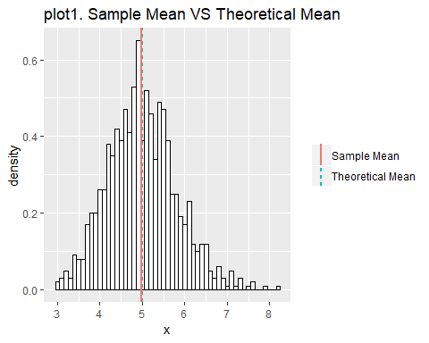
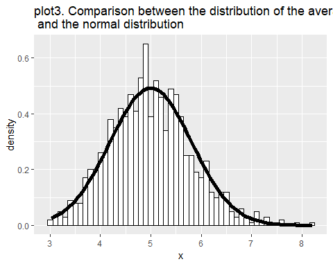

## Overview

The rerport investigated the exponential distribution and the Central Limit Theorem (CLT). We conducted 1000 simulations to build the distribution of the averages of 40 exponentials, the distribution of the variances of 40 exponentials and compared the distribution of averages to the normal distribution.

## Simulation

We set the lambda of the exponential distribution to be 0.2. The theoretical 
mean of the exponential distribution is 1/lambda = 5, the theoretical 
standard deviation is also 1/lambda = 5.  

Then, we did 1000 simulations of the averages of 40 exponentials, and plotted the
distribution of the 1000 averages.


```r
library(ggplot2)
lambda <- 0.2
n <- 40

# The simulation of the avg of 40 exponentials
nosim <- 1000
set.seed(1000)
simMeans <- apply(matrix(rexp(n * nosim, lambda), nosim), 1, mean)
dat <- data.frame(x = c(simMeans),
                  group = factor(rep(c("sample"), each = nosim))
           )

# the statistics
sampleMean <- mean(simMeans)
sampleSd <- sd(simMeans)

# The simulationn of the var of 40 exponentials
set.seed(1000)
simVars <- apply(matrix(rexp(n * nosim, lambda), nosim), 1, var)
dat2 <- data.frame(variance = simVars, 
                   group = factor(rep("sample"), nosim))

# The statistics
varsMean <- mean(simVars)
```

## Sample Mean VS Theoretical Mean

The plot showed the distribution of the averages of 40 exponentials. The black
line indicated the theoretical mean and the red dash line indicated the sample
mean of the averages of 40 exponentials.

<!-- -->

The sample mean is 4.9869634, and the theoretical mean is 5. They are pretty close according to the plot1.   

## Sample Variance VS Theoretical Variance

The variance of the mean of 40 exponentials:  

```r
sampleSd^2
```

```
## [1] 0.6583551
```

The variance of the mean of the 40 exponentials is equal to 0.6583551, which is pretty close to the theoretical variance `(1/lambda)^2/40`, which is 0.625.  

## Distribution

The plot showed the density distribution of the averages of 40 exponentials. The black line indicated the normal distribution

<!-- -->

In the plot3 above, the density distribution of the averages of 40 exponentials
can be approximated by the normal distribution.


