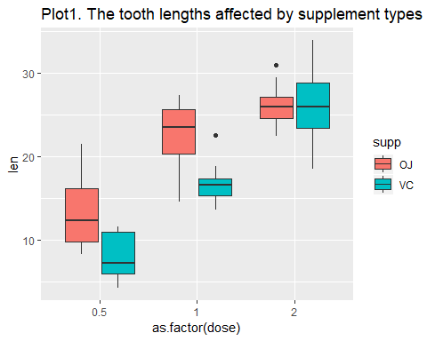

## The ToothGrowth data

The data was collected from 60 guinea pigs. Each animal received one of three 
dose levels (0.5, 1, 2 mg/day) of vitamin C through either orange juice (OJ) or ascorbic acid (VC).

```r
library(ggplot2)
library(datasets)
data(ToothGrowth)
head(ToothGrowth)
```

```
##    len supp dose
## 1  4.2   VC  0.5
## 2 11.5   VC  0.5
## 3  7.3   VC  0.5
## 4  5.8   VC  0.5
## 5  6.4   VC  0.5
## 6 10.0   VC  0.5
```

```r
str(ToothGrowth)
```

```
## 'data.frame':	60 obs. of  3 variables:
##  $ len : num  4.2 11.5 7.3 5.8 6.4 10 11.2 11.2 5.2 7 ...
##  $ supp: Factor w/ 2 levels "OJ","VC": 2 2 2 2 2 2 2 2 2 2 ...
##  $ dose: num  0.5 0.5 0.5 0.5 0.5 0.5 0.5 0.5 0.5 0.5 ...
```

```r
summary(ToothGrowth)
```

```
##       len        supp         dose      
##  Min.   : 4.20   OJ:30   Min.   :0.500  
##  1st Qu.:13.07   VC:30   1st Qu.:0.500  
##  Median :19.25           Median :1.000  
##  Mean   :18.81           Mean   :1.167  
##  3rd Qu.:25.27           3rd Qu.:2.000  
##  Max.   :33.90           Max.   :2.000
```

```r
table(ToothGrowth$dose)
```

```
## 
## 0.5   1   2 
##  20  20  20
```

```r
ggplot(data = ToothGrowth, aes(x = as.factor(dose), y = len, fill = supp)) +
        geom_boxplot() +
        labs(title = "Plot1. The tooth lengths affected by supplement types and dose")
```

<!-- -->

Based on the Plot1, the tooth length increased as the dose of supplements increased.
Also, the animals exposed to orange juice(OJ) had greater tooth length than those exposed to ascorbic(VC).

## Hypothesis tests

**Question 1: Does the orange juice perform better in increasing tooth length in guinea pigs than ascorbic acid?**  
H0: mu(OJ) - mu(VC) <= 0   
Ha: mu(OJ) - mu(VC) > 0  
We used t-test and assumed unequal variance in two supplement types.  
Here are the test results:


```
## 
## 	Welch Two Sample t-test
## 
## data:  len by supp
## t = 1.9153, df = 55.309, p-value = 0.03032
## alternative hypothesis: true difference in means is greater than 0
## 95 percent confidence interval:
##  0.4682687       Inf
## sample estimates:
## mean in group OJ mean in group VC 
##         20.66333         16.96333
```
**Question 2: Does the the higher dosage perform better in increasing tooth length in guinea pigs than the lower dosage ?**  
H0: mu(lower) - mu(higher) >= 0  
Ha: mu(lower) - mu(higher) < 0   
We used t-test and assumed unequal variance in two supplement dosage.  
Here are the test results:


```
##   dosage0.5vs1 dosage0.5vs2   dosage1vs2
## 1 6.341504e-08 2.198762e-14 9.532148e-06
```

## Conclusions

The p-value for question 1 was equal to 0.0303173 and the p-value for question 2 was
6.3415036\times 10^{-8}, 2.1987625\times 10^{-14}, 9.5321476\times 10^{-6} for 0.5 mg/day vs 1 mg/day, 0.5 mg/day vs 2 mg/day, and 1 mg/day vs 2mg/day respectively. 

We set type I error (alpha) equal to 0.05, then we rejected the null hypothesis for both
questions and concluded that the orange juice perform better in increasing tooth length in guinea pigs than ascorbic acid and the higher dosage perform better than the lower dosage.


